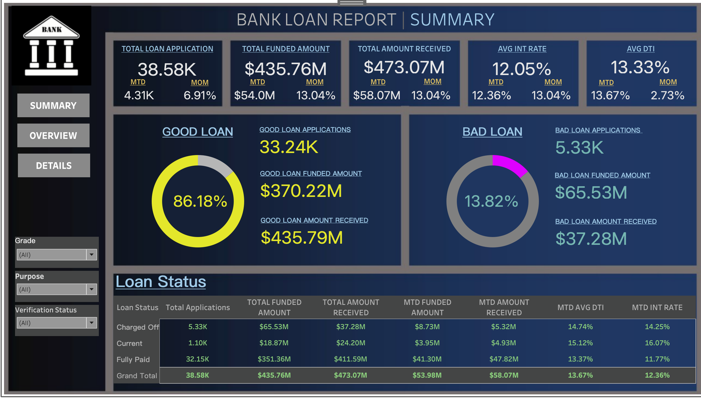
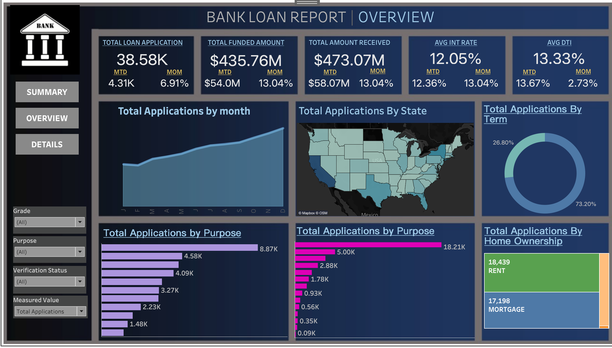
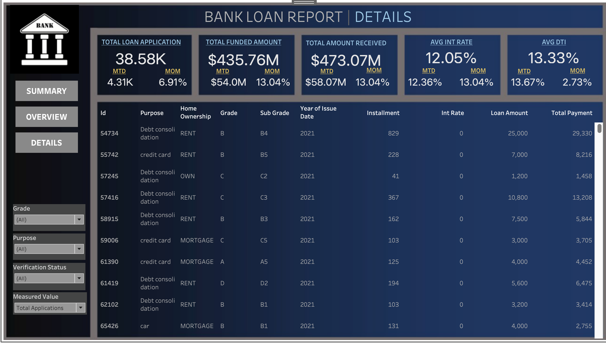

# 💼 Bank Loan Dashboard

This project is a bank loan performance analysis built using **SQL** and visualized using **Tableau**.

It extracts key loan metrics like total applications, repayments, interest rates, good vs. bad loans, and segment-wise performance.

---

## 📌 What’s Covered

- Total, MTD, and PMTD Loan Applications  
- Funded Amounts and Repayments  
- Average Interest Rates and DTI  
- Good vs Bad Loan Breakdown  
- Monthly, Term, State, and Purpose Analysis  

---

## 🛠 Tools Used

- MySQL – SQL queries to generate KPIs  
- Tableau – Dashboard design and visualization  
- Excel – Data validation  
- PowerPoint – Reporting (optional)

---

## 📁 Project Files

- `sql/Bankloan.sql` – Full set of SQL queries  
- `Proj_Bank_Loan.twbx` – Tableau workbook  
- `images/dashboard1.png`, `dashboard2.png`, `dashboard3.png` – Tableau snapshots  

---

## 📸 Dashboard Screenshots

  
  

---

## 👋 About Me

Built by **Ansh Sharma**  
📫 [Connect on LinkedIn](https://www.linkedin.com/in/anshshr1044/)

